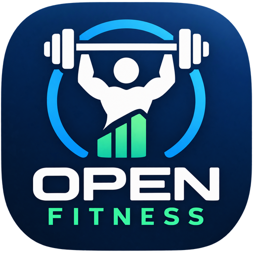

# Open Fitness

Open Fitness is a fitness app written in Kotlin.

It allows for multiple users to share a device, create 
workouts and programs to help improve your fitness.

Hope you enjoy it!

## Screenshots

<table>
<tr>
<th>Light</th>
<th>Dark</th>
</tr>
<tr>
<td>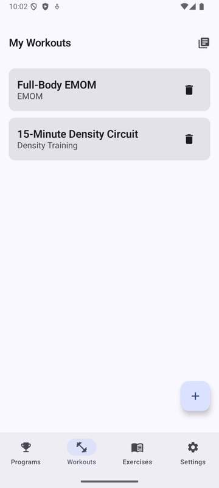</td>
<td>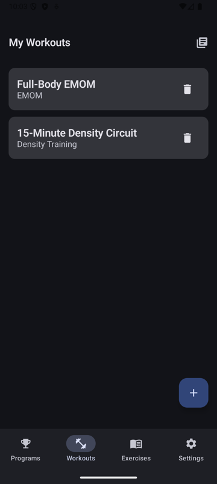</td>
</tr>
<tr>
<td>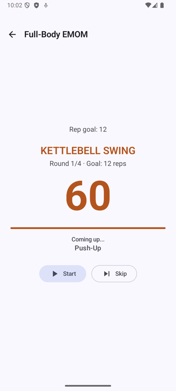</td>
<td>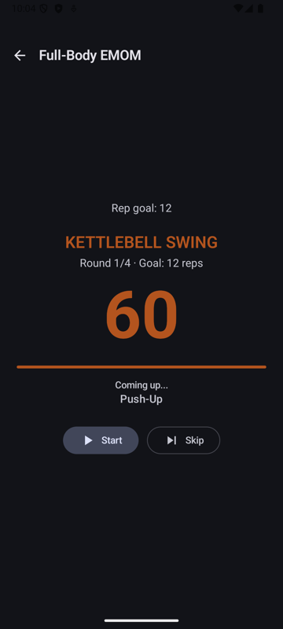</td>
</tr>
<tr>
<td>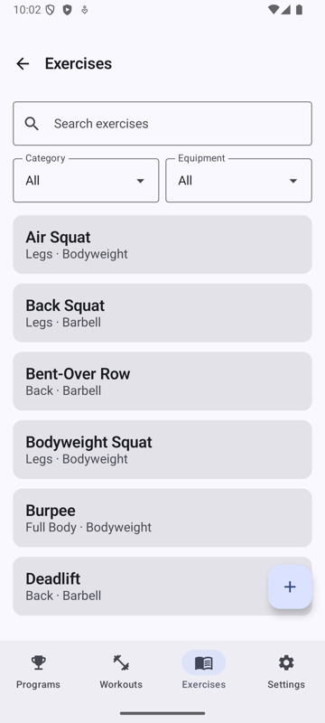</td>
<td>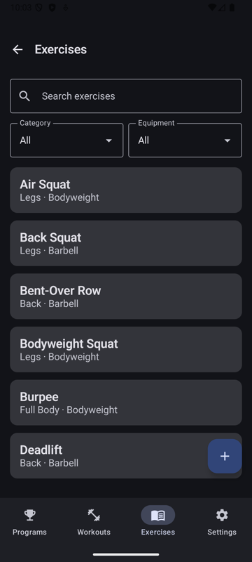</td>
</tr>
<tr>
<td>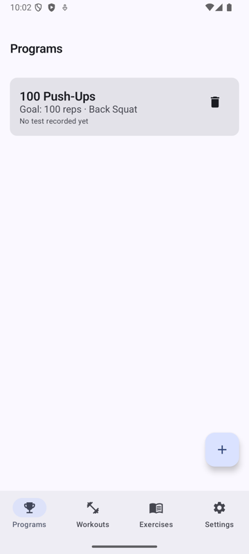</td>
<td>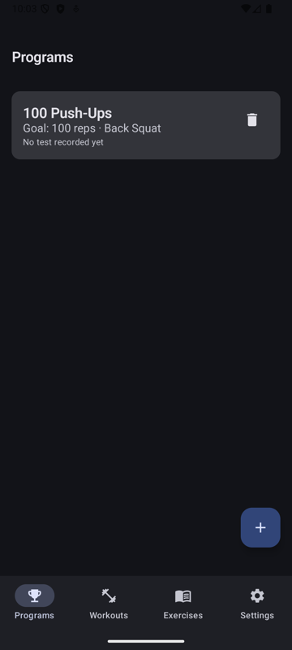</td>
</tr>
<tr>
<td>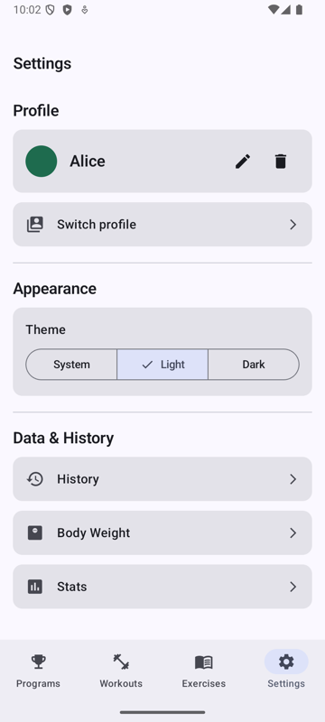</td>
<td>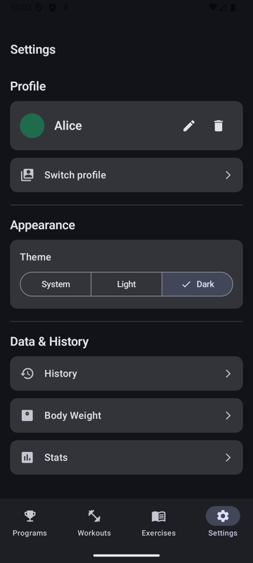</td>
</tr>
</table>